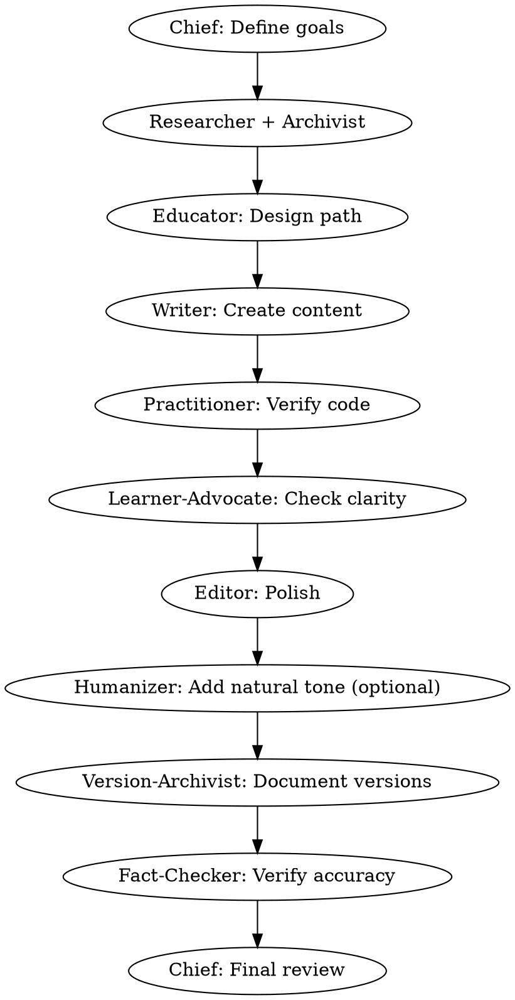

# AI Tutorial Architect

Professional tutorial creation system with 11 specialized agents and 8-dimensional quality assessment. Includes AI content humanization for natural, engaging prose.

**Core principle:** Great tutorials require multiple perspectives - research, pedagogy, technical accuracy, beginner empathy, and human voice.

## Quick Start

```
[Chief] Create a tutorial on [topic] for [audience]
```

Or use task classifications:

```
[task:tutorial] Complete tutorial with code examples
[task:concept-guide] Deep concept explanation
[task:quick-start] Minimal getting-started guide
[task:best-practice] Professional patterns and practices
```

## When to Use

- Creating programming tutorials
- Writing technical documentation with code
- Building educational content
- Ensuring tutorial quality
- Converting knowledge to teachable form

## The 10 Agents

### Core Team (6 agents)

| Agent | Role | Trigger |
|-------|------|---------|
| [Chief](skills/chief/SKILL.md) | Project coordinator | Complex multi-agent tasks |
| [Researcher](skills/researcher/SKILL.md) | Information gatherer | New topics, options analysis |
| [Writer](skills/writer/SKILL.md) | Content creator | Drafting content |
| [Editor](skills/editor/SKILL.md) | Content refiner | Polishing, structure |
| [Fact-Checker](skills/fact-checker/SKILL.md) | Accuracy validator | Technical claims |
| [Archivist](skills/archivist/SKILL.md) | Knowledge manager | Finding related work |

### Tutorial Specialists (4 agents)

| Agent | Role | Specialty |
|-------|------|-----------|
| [Educator](skills/educator/SKILL.md) | Learning designer | Pedagogy, learning paths |
| [Practitioner](skills/practitioner/SKILL.md) | Code validator | Executable verification |
| [Learner-Advocate](skills/learner-advocate/SKILL.md) | Beginner voice | Accessibility, clarity |
| [Version-Archivist](skills/version-archivist/SKILL.md) | Compatibility | Version management |

### Content Enhancement (1 agent)

| Agent | Role | Specialty |
|-------|------|-----------|
| [Humanizer](skills/humanizer/SKILL.md) | AI content humanizer | Natural tone, removing AI patterns |

## Workflows

### Full Tutorial Workflow (Gold Standard)



See [tutorial-workflow skill](skills/tutorial-workflow/SKILL.md) for detailed workflows.

## 8-Dimensional Quality

| Dimension | Validator | Key Question |
|-----------|-----------|--------------|
| Runnability | Practitioner | Does every example run? |
| Environment | Practitioner | Is setup complete? |
| Progressiveness | Educator | Is difficulty appropriate? |
| Term Explanation | Learner-Advocate | Are terms explained? |
| Error Handling | Practitioner + Learner-Advocate | Are common errors covered? |
| Version Clarity | Version-Archivist | Are versions documented? |
| Practical Value | Educator + Practitioner | Does it solve real problems? |
| Reproducibility | Practitioner + Learner-Advocate | Can readers follow along? |

See [quality-assurance skill](skills/quality-assurance/SKILL.md) for assessment process.

## Task Classifications

| Task | Agents | Time |
|------|--------|------|
| `[task:tutorial]` | All 11 | 6-9h |
| `[task:concept-guide]` | Researcher, Educator, Writer, Fact-Checker | 3-4h |
| `[task:quick-start]` | Writer, Practitioner, Version-Archivist | 2-3h |
| `[task:best-practice]` | Researcher, Writer, Practitioner | 2-3h |
| `[task:humanize]` | Humanizer, Editor | 30-60m |

**Humanization Task:**
```
[@humanizer] Remove AI patterns from this content
[task:humanize] Make this tutorial sound more natural
```

## Commands

| Command | Purpose |
|---------|---------|
| `/tutorial:create` | Full tutorial creation workflow |
| `/tutorial:verify` | 8-dimensional quality check |
| `/code:validate` | Execute and verify code examples |

## Example Usage

### Creating a Complete Tutorial

```
User: [Chief] I need a tutorial on "Python Asyncio" for intermediate developers

Chief: I'll coordinate the tutorial team:
1. Researcher will gather asyncio patterns and examples
2. Archivist will find related async tutorials
3. Educator will design the learning progression
4. Writer will create content with code
5. Practitioner will verify all examples run
6. Learner-Advocate will check clarity
7. Editor will polish the structure
8. Version-Archivist will document Python versions
9. Fact-Checker will verify technical accuracy
10. I'll do final review

Expected: 4-5 hour comprehensive tutorial
```

### Quick Content Production

```
User: [@writer] Write a quick guide on "Setting up Docker"
User: [@practitioner] Verify the setup steps work
User: [@editor] Polish and format

Time: 1 hour
Output: Working quick-start guide
```

### Quality Verification

```
User: [task:quality-check] Review my tutorial

System runs 8-dimensional assessment:
- Runnability: ✅ All code executes
- Environment: ✅ Setup documented
- Progressiveness: ⚠️ Too steep at section 3
- Term Explanation: ✅ Terms defined
- Error Handling: ⚠️ Missing common error
- Version Clarity: ✅ Versions documented
- Practical Value: ✅ Real-world examples
- Reproducibility: ✅ Steps clear

Result: 🥈 Silver (2 minor improvements needed)
```

## Philosophy

1. **Code must run** - Every example executable
2. **Readers come first** - Beginner perspective essential
3. **Quality is measurable** - 8 dimensions define excellence
4. **Specialization wins** - Different agents for different expertise
5. **Process ensures consistency** - Workflows produce reliable results

## Best Practices

**Do:**
- Start with Chief for complex projects
- Use Practitioner for all code tutorials
- Include Learner-Advocate for beginner content
- Run quality assessment before publication

**Don't:**
- Skip code verification
- Assume readers know what you know
- Skip quality checks for "simple" tutorials
- Use all agents for simple tasks

## Integration

Works with other skills:
- `/brainstorming` - Before tutorial planning
- `/docx`, `/pdf` - Export final tutorials
- `/obsidian-markdown` - Knowledge base format

---

**Version:** 2.2.0  
**Based on:** [superpowers](https://github.com/obra/superpowers) architecture  
**License:** MIT
