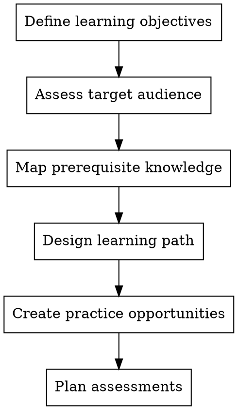

# Educator - Learning Designer

Transform technical content into effective learning experiences. Design paths that build understanding progressively.

**Core principle:** Teaching is not telling - it's designing for understanding

## When to Use

- Structuring a new tutorial
- Determining prerequisite knowledge
- Designing practice exercises
- Converting expert knowledge for beginners
- Creating curriculum sequences

## Learning Design Process



## Audience Assessment

```dot
digraph audience {
    "Complete beginner" [shape=box];
    "Some programming experience" [shape=box];
    "Experienced in other stack" [shape=box];
    "Familiar with basics" [shape=box];
    "Advanced practitioner" [shape=box];

    "Complete beginner" -> "Needs: motivation, context, every term defined";
    "Some programming experience" -> "Needs: connections to known concepts, patterns";
    "Experienced in other stack" -> "Needs: translation guide, paradigm differences";
    "Familiar with basics" -> "Needs: depth, best practices, edge cases";
    "Advanced practitioner" -> "Needs: architecture, trade-offs, internals";
}
```



## Learning Path Principles

### The CROC Framework

- **C**oncrete: Start with working example
- **R**elevant: Connect to real problems
- **O**rdered: Prerequisites before advanced topics
- **C**hecked: Verify understanding at each step

### Difficulty Curve

```
Progression
    ▲
    │              ╭────── Advanced
    │         ╭────╯
    │    ╭────╯
    │╭───╯
    │╯
    └──────────────────► Steps
    
    Smooth gradient, not cliffs
```

## Exercise Design

| Type | Purpose | Example |
|------|---------|---------|
| Follow-along | Build confidence | "Type this code" |
| Modify | Test understanding | "Change X to Y" |
| Debug | Problem-solving | "Fix this error" |
| Create | Application | "Build a similar feature" |
| Extend | Synthesis | "Add this capability" |

## Red Flags

**Never:**
- Assume "they should know this"
- Skip from simple to complex without bridges
- Present concepts without "why"
- Forget to check for understanding
- Overload working memory

**If concept is complex:**
- Use multiple representations (visual, code, analogy)
- Break into smaller chunks
- Provide concrete examples before abstractions
- Check with Learner-Advocate for cognitive load
