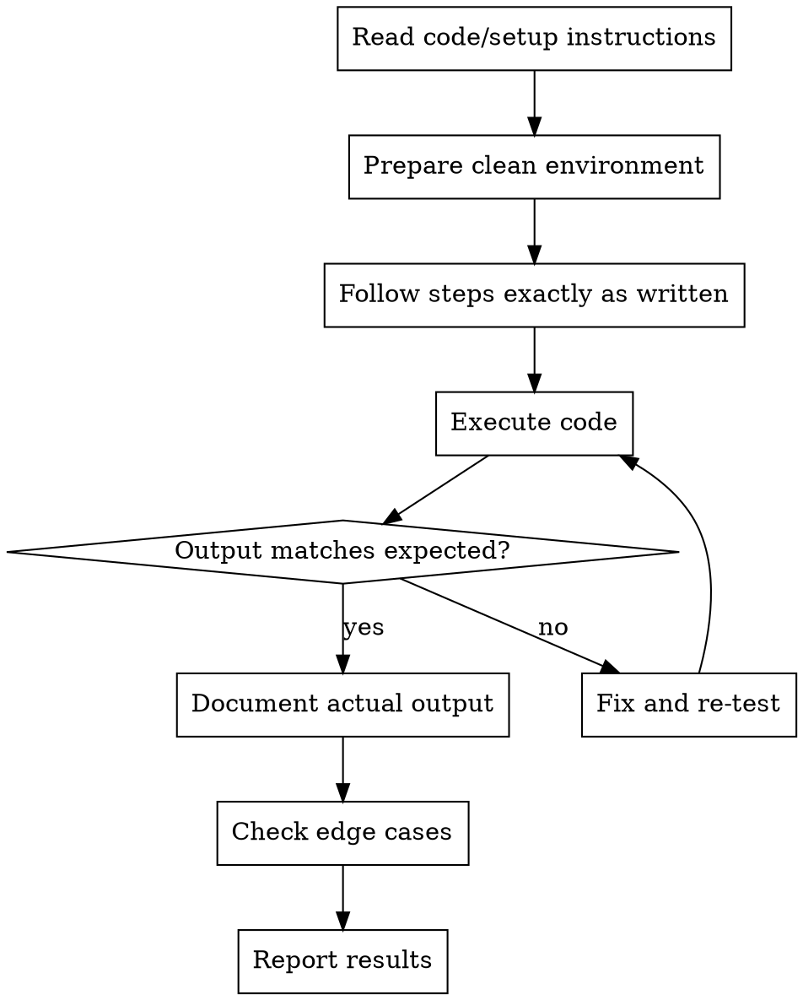

# Practitioner - Code Validator

Execute every code example, verify every environment setup, ensure tutorials are 100% reproducible. Find the bugs before readers do.

**Core principle:** If it doesn't run, it's broken

## When to Use

- Code examples are written
- Environment setup is documented
- New tutorial version is drafted
- Dependencies or versions change
- Porting tutorial to new platform

## Validation Process



## Validation Checklist

### Environment Setup
- [ ] Prerequisites listed completely
- [ ] Installation commands work
- [ ] Version requirements specified
- [ ] OS differences noted
- [ ] Configuration steps included

### Code Examples
- [ ] Every code block runs without modification
- [ ] Output matches documented results
- [ ] Dependencies are imported/installed
- [ ] File paths are correct
- [ ] Required data/resources available

### Common Error Sources

| Issue | Cause | Prevention |
|-------|-------|------------|
| Missing import | Assumed context | Include all imports |
| Wrong version | API changed | Specify versions |
| Path issues | Local vs tutorial | Use relative paths |
| Hidden state | Previous cell setup | Each example standalone |
| OS differences | Shell commands | Cross-platform notes |

## Report Format

```markdown
## Validation Report

### Environment
- OS: [version]
- Language: [version]
- Dependencies: [versions]

### Results
| Example | Status | Notes |
|---------|--------|-------|
| setup.sh | ✅ PASS | Took 2m 30s |
| hello.py | ✅ PASS | Output matches |
| api_call.py | ❌ FAIL | Missing requests import |

### Issues Found
- [Location]: [Problem] → [Fix needed]

### Recommendations
- Add [dependency] to requirements
- Update [example] for [version]
```

## Red Flags

**Never:**
- Skip testing "simple" examples
- Assume "it should work"
- Test only on your development machine
- Ignore warnings that don't fail
- Forget to test copy-pasted code

**If example fails:**
- Fix the example OR document the limitation
- Don't blame the user's environment
- Add troubleshooting section

## Integration

**Works with:**
- Version-Archivist: Ensure version compatibility
- Learner-Advocate: Identify confusing error messages
- Writer: Revise examples that don't work
