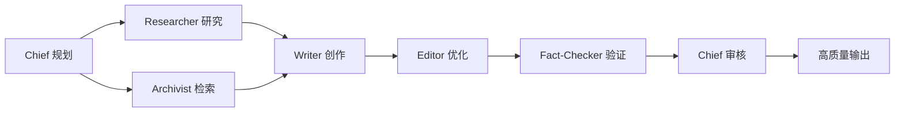

<div align="center">

# 🎓 AI Tutorial Architect

[](LICENSE)
[](https://claude.com/claude-code)
[](https://github.com/yangmeishux/ai-tools/tree/main/ai-tutorial-architect)
[]()

**🎯 专业的 AI 编程教程架构师 - 打造金牌质量的技术教程**

基于 [newtype-profile](https://github.com/newtype-01/newtype-profile) 架构，通过 **10 个专业 AI Agent** 协作，提供从教学设计、代码验证到质量评估的全流程教程创作支持

**🆕 v2.0 专业版**：4 个教程专用角色 + 8 维质量评估体系 + 反馈闭环机制

[核心功能](#-核心功能) • [快速开始](#-快速开始) • [使用示例](#-使用示例) • [质量标准](#-质量标准) • [文档](#-文档)

[English](./README_EN.md) • 简体中文

</div>

---

## ✨ 为什么选择 AI Tutorial Architect？

🤔 **传统教程创作的问题**：
- ❌ 代码示例无法运行
- ❌ 初学者难以理解
- ❌ 缺乏教学设计
- ❌ 版本信息不明确
- ❌ 质量标准缺失

✅ **AI Tutorial Architect 的优势**：
- ✅ **10 个专业 Agent** 各司其职（6 个基础 + 4 个教程专用）
- ✅ **8 维质量评估** 确保金牌标准
- ✅ **代码实战验证** 保证 100% 可运行
- ✅ **读者视角审查** 确保认知友好
- ✅ **版本追踪管理** 避免教程失效
- ✅ **教学设计专业** 提升学习效果

<div align="center">

**不是简单地写教程，而是架构完整的学习体验！**

</div>

---

## 📊 核心功能

### 🎭 10 大专业 Agent

#### 基础角色（6 个）

| Agent | 角色 | 🎯 核心能力 | ⚡ 使用场景 |
|:-----:|:-----:|:-----------|:-----------|
| **Chief** | 主编/协调者 | 任务规划、团队协调、最终审核 | 复杂项目、多步骤任务 |
| **Researcher** | 研究员 | 信息收集、趋势调研、背景研究 | 市场分析、技术研究 |
| **Writer** | 作者 | 内容创作、文章撰写、文案生成 | 文章写作、内容生产 |
| **Editor** | 编辑 | 内容优化、结构调整、语言精炼 | 内容审查、质量提升 |
| **Fact-Checker** | 核查员 | 事实验证、数据检查、来源评估 | 事实核查、数据验证 |
| **Archivist** | 档案员 | 知识检索、文档查找、关联建立 | 知识管理、文档检索 |

#### ⭐ AI 编程教程专用（4 个）

| Agent | 角色 | 🎯 核心能力 | ⚡ 使用场景 |
|:-----:|:-----:|:-----------|:-----------|
| **Educator** | 技术教育专家 | 学习路径设计、概念转化、难度把控 | 教程规划、教学设计 |
| **Practitioner** | 代码实战验证者 | 代码可运行性验证、环境测试、常见错误标注 | 代码验证、实战测试 |
| **Learner-Advocate** | 读者代表 | 初学者视角审查、困惑点识别、术语检查 | 可读性审查、认知优化 |
| **Version-Archivist** | 版本追踪者 | 版本标注、API 追踪、兼容性管理 | 版本管理、升级维护 |

**为什么需要这些角色？**

传统内容创作 vs AI 编程教程：
- 📝 **技术准确性**（Fact-Checker）≠ **可运行性**（Practitioner）
- 📖 **内容质量**（Editor）≠ **教学质量**（Educator）
- 👀 **逻辑通顺**（Writer）≠ **认知友好**（Learner-Advocate）
- 📚 **信息准确**（Fact-Checker）≠ **版本明确**（Version-Archivist）

### 🔄 三种使用方式

#### 方式 1️⃣: 让主编协调（推荐用于复杂任务）

```bash
[Chief] 我需要写一篇关于 AI Agent 技术的深度文章
```

**Chief 自动**：
- ✅ 分解任务为 6 个阶段
- ✅ 协调所有 Agent 协作
- ✅ 设置质量检查点
- ✅ 整合最终输出

#### 方式 2️⃣: 指定特定 Agent（推荐用于单一任务）

```bash
[@researcher] 研究 2024 年 AI 发展趋势
[@writer] 基于研究结果撰写文章
[@editor] 审查并优化文章结构
[@fact-checker] 验证所有技术细节
```

#### 方式 3️⃣: 任务分类（快速模式）

**通用任务**：
```bash
[task:research] 调研区块链应用场景
[task:writing] 撰写技术白皮书
[task:editing] 优化报告结构
[task:fact-check] 验证数据准确性
```

**AI 编程教程专用** ⭐：
```bash
[task:tutorial] 创建"用 Cursor AI 做 React 开发"完整教程
[task:concept-guide] 深入讲解 RAG 技术概念
[task:quick-start] 写一个 LangChain 快速上手指南
[task:best-practice] 总结 AI 编程的最佳实践
```

---

## 🚀 快速开始

### 📥 安装

<details>
<summary><b>方式 1: Git 克隆（推荐）</b></summary>

```bash
# 进入 Claude Code SKILLS 目录
cd ~/.claude/skills

# 克隆仓库
git clone https://github.com/yangmeishux/ai-tools/tree/main/ai-tutorial-architect.git

# 验证安装
ls ai-tutorial-architect/SKILL.md  # 应该显示文件存在
```

</details>

<details>
<summary><b>方式 2: 手动下载</b></summary>

1. 访问 [Releases](https://github.com/yangmeishux/ai-tools/tree/main/ai-tutorial-architect/releases) 页面
2. 下载最新版本的 ZIP 文件
3. 解压到 `~/.claude/skills/` 目录
4. 确保文件夹名为 `ai-tutorial-architect`

</details>

<details>
<summary><b>方式 3: 复制文件（最简单）</b></summary>

```bash
# Windows PowerShell
Copy-Item -Path "ai-tutorial-architect" -Destination "$env:USERPROFILE\.claude\skills\" -Recurse

# Linux/Mac
cp -r ai-tutorial-architect ~/.claude/skills/
```

</details>

### ✅ 验证安装

```bash
# 启动 Claude Code
claude

# 测试 SKILL
> [Chief] 测试一下 AI Agent Team 是否正常工作
```

如果看到 Agent 团队响应，说明安装成功！

---

## 💡 使用示例

### 示例 1️⃣: 完整内容创作流程

```bash
# 启动 Claude Code
claude

# 让主编协调团队完成复杂任务
> [Chief] 我需要写一篇关于 AI Agent 技术的深度技术文章
```

**执行流程**：
```
Phase 1: 研究准备
  ├─ Researcher → 研究技术原理、应用场景、发展趋势
  └─ Archivist → 查找相关文档和案例

Phase 2: 内容创作
  └─ Writer → 撰写深度技术文章 (2000+字)

Phase 3: 质量优化
  ├─ Editor → 结构优化、语言精炼
  └─ Fact-Checker → 验证技术细节和数据

Phase 4: 最终输出
  └─ Chief → 整合审核、质量把控

总耗时: 约 2.5-3 小时
产出: 2000-3000字高质量技术文章
```

### 示例 2️⃣: 研究分析任务

```bash
# 并行研究分析
> [@researcher] 调研量子计算在金融领域的应用
> [@archivist] 查找我们之前的相关研究
> [@fact-checker] 验证所有引用和数据

# 整合报告
> [Chief] 基于研究结果，撰写分析报告
```

**产出**：
- ✅ 完整的研究分析报告
- ✅ 数据引用准确
- ✅ 历史资料关联
- ✅ 专业可信度高

### 示例 3️⃣: 快速内容生产

```bash
# 快速模式
> [task:writing] 撰写产品发布新闻稿
> [task:editing] 优化文档结构和表达
> [task:fact-check] 验证技术参数

# 1 小时内完成
```

---

## 📚 工作流程

### 标准内容创作流程



### 快速模式流程


---

## 🎯 最佳实践

### ✅ DO (推荐做法)

1. **明确任务目标**
   ```bash
   ❌ [Chief] 写一篇文章
   ✅ [Chief] 写一篇关于 AI Agent 的技术文章，2000字，面向开发者
   ```

2. **合理选择 Agent**
   ```bash
   简单任务 → 直接指定 Agent
   复杂任务 → 让 Chief 协调团队
   快速任务 → 使用 [task:category]
   ```

3. **遵循工作流程**
   ```
   研究先行 (Researcher → Writer)
   验证在后 (Fact-Checker)
   迭代优化 (多轮 Editor)
   ```

4. **提供具体反馈**
   ```bash
   ✅ [@editor] 第二段逻辑不清，需要重写
   ✅ [@fact-checker] 这个数据需要验证来源
   ```

### ❌ DON'T (避免做法)

1. ❌ 对简单任务使用全部 Agent（效率低）
2. ❌ 跳过研究和验证环节（质量差）
3. ❌ 忽略编辑优化步骤（不专业）
4. ❌ 在不同 Agent 间重复相同信息（浪费）

---

## 🔗 与其他 SKILL 配合

### 完整内容生产管道

```bash
/brainstorming          # 1. 头脑风暴，明确需求
  ↓
/ai-agent-team          # 2. Agent 团队协作创作
  ↓
/docx                   # 3. 生成 Word 文档
  ↓
/pdf                    # 4. 导出最终 PDF
```

### 研究分析管道

```bash
/ai-agent-team          # 1. 团队研究分析
  ↓
/obsidian-markdown      # 2. 格式化为 Obsidian 笔记
  ↓
/xlsx                   # 3. 创建数据表格
  ↓
/pptx                   # 4. 生成演示文稿
```

### 技术文档管道

```bash
/planning-with-files     # 1. 规划文档结构
  ↓
/ai-agent-team          # 2. 团队协作写作
  ↓
/frontend-design        # 3. 设计文档样式
  ↓
/theme-factory          # 4. 应用专业主题
```

---

## 📊 与 newtype-profile 对比

| 特性 | newtype-profile | ai-agent-team |
|:-----|:----------------|:--------------|
| **运行平台** | OpenCode | Claude Code |
| **支持模型** | Claude + Gemini | Claude |
| **Agent 实现** | 独立进程 | SKILL 调用 |
| **并行执行** | 真并行 | 逻辑并行 |
| **配置方式** | JSON 文件 | SKILL.md |
| **MCP 集成** | 原生支持 | 需配合其他 SKILL |
| **使用难度** | 较复杂 | ⭐ 简单易用 |
| **适用场景** | 专业用户 | Claude Code 用户 |
| **安装方式** | npm 安装 | Git 克隆/复制 |

### 💡 如何选择？

- 选择 **newtype-profile** 如果你：
  - 使用 OpenCode 平台
  - 需要多模型支持（Claude + Gemini）
  - 需要真正的并行执行
  - 需要原生 MCP 集成

- 选择 **ai-agent-team** 如果你：
  - 使用 Claude Code
  - 需要简单易用的方案
  - 希望开箱即用
  - 需要与其他 SKILL 配合

---

## 📁 项目结构

```
ai-tutorial-architect/
├── .github/
│   ├── workflows/          # GitHub Actions 配置
│   │   └── ci.yml          # 持续集成
│   ├── ISSUE_TEMPLATE/     # Issue 模板
│   ├── PULL_REQUEST_TEMPLATE.md  # PR 模板
│   └── dependabot.yml      # 依赖更新
├── docs/                   # 详细文档
│   ├── ARCHITECTURE.md     # 架构说明
│   ├── API.md              # API 文档
│   └── EXAMPLES.md         # 更多示例
├── examples/               # 使用示例
│   ├── simple_usage.md
│   └── advanced_workflows.md
├── SKILL.md                # SKILL 配置文件（核心）
├── README.md               # 项目说明（本文件）
├── README-ZH.md            # 中文版说明
├── QUICK_REFERENCE.md      # 快速参考卡片
├── CHANGELOG.md            # 更新日志
├── CONTRIBUTING.md         # 贡献指南
├── LICENSE                 # MIT 许可证
└── .gitignore              # Git 忽略配置
```

---

## 🌟 核心特性

- ✅ **开箱即用**：无需复杂配置，安装即可使用
- ✅ **Claude Code 原生**：完美集成 SKILL 系统
- ✅ **灵活协作**：可与其他 51+ SKILL 配合
- ✅ **结构化流程**：规范的工作流程和质量保证
- ✅ **多重验证**：3 层质量检查机制
- ✅ **完整文档**：详细的使用指南和示例
- ✅ **持续更新**：活跃维护和功能迭代
- ✅ **社区支持**：欢迎贡献和反馈

---

## 📈 路线图

### v1.0 (当前版本) ✅
- ✅ 6 个核心 Agent
- ✅ 三种使用方式
- ✅ 完整工作流程
- ✅ 质量检查机制
- ✅ 详细文档

### v1.1 (计划中) 🚧
- ⏳ 添加 Agent 性能统计
- ⏳ 支持自定义 Agent
- ⏳ 添加更多任务分类
- ⏳ 优化并行处理逻辑

### v2.0 (未来) 🔮
- 🔮 Web UI 控制面板
- 🔮 Agent 性能分析
- 🔮 自定义工作流程
- 🔮 插件系统

---

## 🤝 贡献

我们欢迎各种形式的贡献！

### 如何贡献？

1. 🍴 Fork 本仓库
2. 🌿 创建特性分支 (`git checkout -b feature/AmazingFeature`)
3. 💾 提交更改 (`git commit -m 'Add some AmazingFeature'`)
4. 📤 推送到分支 (`git push origin feature/AmazingFeature`)
5. 🔀 开启 Pull Request

详细指南请查看 [CONTRIBUTING.md](CONTRIBUTING.md)

### 贡献者

感谢所有贡献者！

<a href="https://github.com/yangmeishux/ai-tools/tree/main/ai-tutorial-architect/graphs/contributors">
  
</a>

---

## 📝 许可证

本项目基于 [MIT License](LICENSE) 开源

```
Copyright (c) 2026 yangmeishux

Permission is hereby granted, free of charge, to any person obtaining a copy
of this software and associated documentation files (the "Software"), to deal
in the Software without restriction...
```

---

## 🙏 致谢

- **灵感来源**: [newtype-01/newtype-profile](https://github.com/newtype-01/newtype-profile) - AI Agent Collaboration System
- **基础架构**: [oh-my-opencode](https://github.com/code-yeongyu/oh-my-opencode) - OpenCode Agent 框架
- **原作者**: [黄益贺 (huangyihe)](https://github.com/newtype-01)
- **Claude Code**: [Anthropic](https://www.anthropic.com) - Claude Code CLI

---

## 📮 联系方式

- **作者**: [yangmeishux](https://github.com/yangmeishux)
- **项目主页**: [https://github.com/yangmeishux/ai-agent-team](https://github.com/yangmeishux/ai-agent-team)
- **问题反馈**: [Issues](https://github.com/yangmeishux/ai-agent-team/issues)
- **功能建议**: [Discussions](https://github.com/yangmeishux/ai-agent-team/discussions)

---

## 🌟 如果这个项目对你有帮助

请给它一个 ⭐ **Star**！这会让更多人发现这个项目。

也欢迎分享给你的朋友和同事！

---

<div align="center">

**Made with ❤️ by [yangmeishux](https://github.com/yangmeishux)**

**基于 [newtype-profile](https://github.com/newtype-01/newtype-profile) 架构**

[⬆ 返回顶部](#-ai-agent-team-skill) • [📖 文档](#-文档) • [🤝 贡献](#-贡献) • [📮 联系](#-联系方式)

</div>
