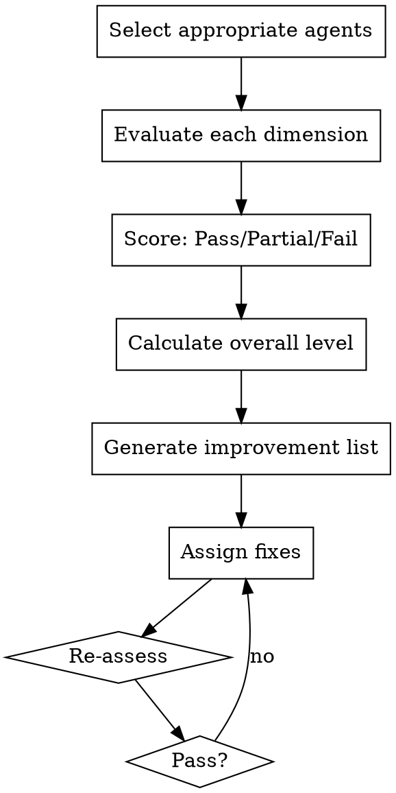

# Quality Assurance - 8-Dimensional Assessment

Evaluate tutorials against the 8-dimension quality framework. Ensure gold-standard deliverables.

**Core principle:** Quality is measurable and mandatory

## When to Use

- Final review before publication
- Updating existing tutorials
- Benchmarking tutorial quality
- Identifying improvement areas

## The 8 Dimensions

```dot
digraph dimensions {
    rankdir=TB;

    "Runnability" [shape=box];
    "Environment Completeness" [shape=box];
    "Progressiveness" [shape=box];
    "Term Explanation" [shape=box];
    "Error Handling" [shape=box];
    "Version Clarity" [shape=box];
    "Practical Value" [shape=box];
    "Reproducibility" [shape=box];

    "Runnability" -> "All code executes correctly";
    "Environment Completeness" -> "Setup fully documented";
    "Progressiveness" -> "Appropriate difficulty curve";
    "Term Explanation" -> "Terms defined when introduced";
    "Error Handling" -> "Common errors addressed";
    "Version Clarity" -> "Versions specified";
    "Practical Value" -> "Solves real problems";
    "Reproducibility" -> "Steps clearly defined";
}
```



## Dimension Checklists

### 1. Runnability (Practitioner)
- [ ] Every code example executes without error
- [ ] Output matches documented results
- [ ] Examples run in clean environment
- [ ] No hidden dependencies

### 2. Environment Completeness (Version-Archivist)
- [ ] Prerequisites listed
- [ ] Installation steps provided
- [ ] Version requirements specified
- [ ] OS differences noted

### 3. Progressiveness (Educator)
- [ ] Difficulty increases gradually
- [ ] Prerequisites taught before advanced topics
- [ ] Each step has clear learning goal
- [ ] Practice exercises included

### 4. Term Explanation (Learner-Advocate)
- [ ] Terms defined on first use
- [ ] Analogies provided for complex concepts
- [ ] No unexplained jargon
- [ ] Glossary or index provided

### 5. Error Handling (Learner-Advocate + Practitioner)
- [ ] Common errors anticipated from learner perspective
- [ ] Troubleshooting steps provided
- [ ] Error messages explained clearly
- [ ] Solutions and workarounds given

### 6. Version Clarity (Version-Archivist)
- [ ] All versions documented
- [ ] Version compatibility explained
- [ ] API changes noted
- [ ] Update path provided

### 7. Practical Value (Educator)
- [ ] Solves real-world problem
- [ ] Code is reusable
- [ ] Applications demonstrated
- [ ] Not toy examples
- [ ] Solves real-world problem
- [ ] Code is reusable
- [ ] Applications demonstrated
- [ ] Not toy examples

### 8. Reproducibility (Practitioner)
- [ ] Steps unambiguous and complete
- [ ] Intermediate results verifiable
- [ ] Complete, copy-paste ready examples
- [ ] Environment variations documented
- [ ] Steps unambiguous
- [ ] Intermediate results verifiable
- [ ] Complete examples provided
- [ ] Variations documented

## Quality Levels

| Level | Dimensions Passed | Use Case |
|-------|-------------------|----------|
| 🥇 Gold | 8/8 | Production tutorials |
| 🥈 Silver | 6-7/8 | Good tutorials |
| 🥉 Bronze | 4-5/8 | Minimum acceptable |
| ❌ Below | <4/8 | Needs work |

## Assessment Process



## Report Format

```markdown
## Quality Assessment Report

### Overall Rating: 🥇 Gold / 🥈 Silver / 🥉 Bronze

### Dimension Scores
| Dimension | Score | Checked By | Notes |
|-----------|-------|------------|-------|
| Runnability | ✅/⚠️/❌ | Practitioner | |
| Environment | ✅/⚠️/❌ | Version-Archivist | |
| Progressiveness | ✅/⚠️/❌ | Educator | |
| Term Explanation | ✅/⚠️/❌ | Learner-Advocate | |
| Error Handling | ✅/⚠️/❌ | Practitioner | |
| Version Clarity | ✅/⚠️/❌ | Version-Archivist | |
| Practical Value | ✅/⚠️/❌ | Educator | |
| Reproducibility | ✅/⚠️/❌ | Practitioner | |

### Required Improvements
- [ ] [Dimension]: [Issue] → [Fix assigned to]

### Approved For
- [ ] Publication
- [ ] Publication with noted limitations
- [ ] Needs revision
```

## Red Flags

**Never:**
- Self-assess without independent review
- Skip dimensions because "they're obvious"
- Accept critical failures
- Publish without documented quality level

**If quality is insufficient:**
- Document what's missing
- Assign specific fixes
- Re-assess after fixes
