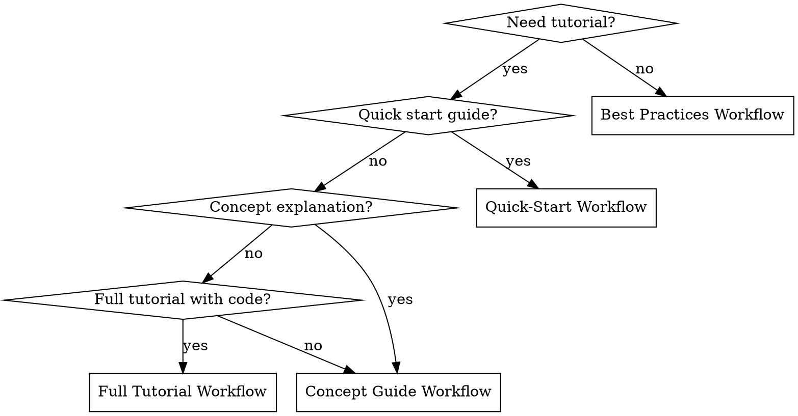
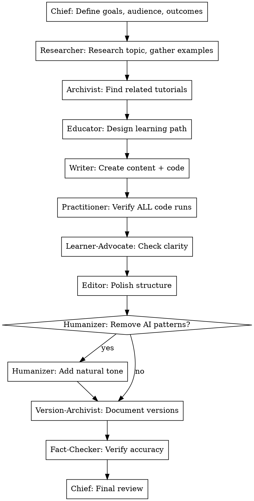

# Tutorial Creation Workflow

Complete workflow for creating professional AI programming tutorials with guaranteed quality.

**Core principle:** Systematic process produces consistent quality

## When to Use

- Starting a new tutorial
- Choosing workflow for tutorial creation
- Ensuring quality standards
- Training new team members on process

## Workflow Selection



## Full Tutorial Workflow (Gold Standard)



**When to include Humanizer:**
- Content will be published externally
- Target audience expects natural, conversational tone
- Previous feedback mentioned "sounding robotic"
- Blog posts, opinion pieces, or narrative content

**Skip Humanizer for:**
- API documentation (keep dry and precise)
- Code comments (clarity over style)
- Legal/compliance text (accuracy critical)
- Internal technical specs

## Quick-Start Workflow (2-3 hours)

```
Chief: Define scope
    ↓
Researcher: Quick research (15 min)
Writer: Draft content with code (60 min)
    ↓
Practitioner: Verify code works (30 min)
Editor: Quick polish (30 min)
    ↓
Chief: Review and publish
```

## Concept Guide Workflow

```
Chief: Define concept and depth
    ↓
Researcher: Deep research on concept
Educator: Determine explanation approach
    ↓
Writer: Create explanation with analogies
Fact-Checker: Verify technical accuracy
    ↓
Learner-Advocate: Check understanding
Editor: Refine flow
    ↓
Chief: Final review
```

## Task Classification Quick Reference

| Task | Category | Primary Agents | Time |
|------|----------|----------------|------|
| Complete tutorial | tutorial | All 11 agents | 6-9h |
| Concept deep-dive | concept-guide | Researcher, Educator, Writer, Fact-Checker | 3-4h |
| Quick getting-started | quick-start | Writer, Practitioner, Version-Archivist | 2-3h |
| Best practices doc | best-practice | Researcher, Writer, Practitioner | 2-3h |
| Research only | research | Researcher, Archivist | 1-2h |
| Writing only | writing | Writer, Editor | 1-2h |
| Editing only | editing | Editor | 30-60m |
| Humanization | humanize | Humanizer, Editor | 30-60m |

## New: Humanization Workflow

```
Editor: Polish structure
    ↓
Humanizer: Scan for AI patterns
    ↓
Humanizer: Rewrite with natural tone
    ↓
Fact-Checker: Verify accuracy preserved
    ↓
Editor: Final polish
```

**Use via:**
```
[@humanizer] Remove AI patterns from this tutorial
[task:humanize] Make this content sound more natural
```

## Quality Gates

Each workflow has checkpoints:

1. **Plan approved:** Goals, audience, outline clear
2. **Content complete:** All sections drafted
3. **Code verified:** All examples run successfully
4. **Review passed:** Clarity and accuracy confirmed
5. **Final approved:** Ready for publication

## Red Flags

**Never:**
- Skip Practitioner verification for code tutorials
- Skip Learner-Advocate for beginner content
- Skip Version-Archivist for version-sensitive topics
- Skip Fact-Checker for technical claims

**If behind schedule:**
- Cut scope, not quality
- Use Quick-Start instead of Full
- Deliver working partial rather than broken complete
