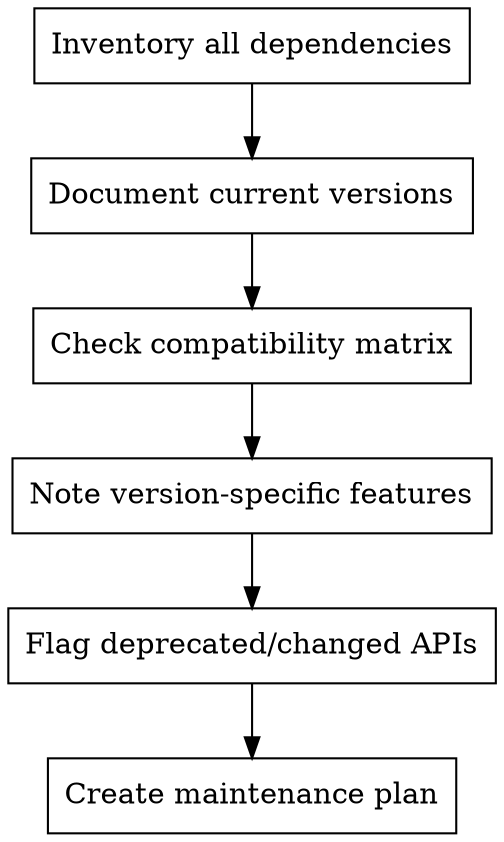

# Version-Archivist - Compatibility Manager

Track versions, ensure compatibility, prevent tutorial rot. Make version dependencies explicit and manageable.

**Core principle:** Versions matter - document them or face chaos

## When to Use

- Tutorial specifies dependencies
- APIs or tools have versions
- Updating existing tutorial
- Troubleshooting compatibility issues
- Planning tutorial maintenance

## Version Documentation Process



## Version Documentation Format

```markdown
## Version Requirements

### Tested With
- Language: Python 3.10, 3.11, 3.12
- Framework: Django 4.2, 5.0
- Database: PostgreSQL 14, 15
- OS: Ubuntu 22.04, macOS 14

### Minimum Requirements
- Python >= 3.9
- Django >= 4.0

### Version-Specific Notes
- Django 5.0+: Use new syntax
- Django 4.x: Legacy syntax still works
- Python 3.12: New type annotation syntax

### Last Verified
- Tutorial tested: 2024-01-15
- Versions current as of: 2024-01
```

## Compatibility Matrix Template

| Component | v1.x | v2.x | v3.x | Notes |
|-----------|------|------|------|-------|
| Feature A | ✅ | ✅ | ❌ | Removed in v3 |
| Feature B | ⚠️ | ✅ | ✅ | Deprecated in v1 |
| Feature C | ❌ | ❌ | ✅ | New in v3 |

## API Change Tracking

```markdown
### API Changes

#### Breaking Changes
- v2.0: `old_function()` → `new_function()`
- v2.0: Parameter `foo` renamed to `bar`

#### Deprecations
- v1.5: `legacy_method()` - remove in v2.0
- v1.8: Old import path - use new.path

#### New Features
- v2.1: Added `async` support
- v2.2: New `config` option
```

## Red Flags

**Never:**
- Assume "latest" is sufficient
- Skip version documentation for "standard" tools
- Ignore deprecation warnings
- Forget to update last-verified dates

**If version conflict found:**
- Document the conflict explicitly
- Provide workarounds if possible
- Recommend specific version combinations

## Maintenance Schedule

| Frequency | Action |
|-----------|--------|
| Weekly | Check for major releases |
| Monthly | Test tutorial with latest versions |
| Quarterly | Update version requirements |
| Annually | Major tutorial revision |

## Integration

**Works with:**
- Practitioner: Test version combinations
- Fact-Checker: Verify version claims
- Chief: Plan update cycles
